# 🎢 Túnel del Terror  
**Desarrollo, empaquetado y distribución de una aplicación JavaFX**

---

## 🧠 Introducción

En esta práctica se ha simulado un **caso real de distribución de software**, partiendo de una aplicación JavaFX funcional y recorriendo todas las fases necesarias hasta obtener un **instalador para Windows**, listo para que un usuario final pueda instalar y ejecutar la aplicación.

La aplicación desarrollada se llama **Túnel del Terror**, una aplicación gráfica realizada con **JavaFX**, empaquetada como **JAR ejecutable**, convertida posteriormente en **archivo `.exe`** y finalmente distribuida mediante un **instalador creado con Inno Setup**.

---

## 🛠️ Tecnologías utilizadas

- ☕ **Java 21**
- 🎨 **JavaFX**
- 📦 **Maven**
- 🚀 **Launch4j**
- 💿 **Inno Setup**
- 🖥️ **Windows**

---

## 1️⃣ Generación del JAR ejecutable con Maven

El primer paso consistió en generar un JAR ejecutable a partir del proyecto JavaFX.

Para ello:

- Se configuró correctamente el archivo pom.xml

- Se definió como clase principal:

**org.example.tarea_modulo_5.Launcher**

- Se utilizó Maven Shade Plugin para generar un fat JAR, incluyendo todas las dependencias necesarias (JavaFX) en:

**mvn > clean > package**

- Una vez generado el JAR, se comprobó su correcto funcionamiento ejecutándolo desde consola:

`java -jar Tarea_Modulo_5-1.0-SNAPSHOT.jar`

✅ La aplicación se abre correctamente, mostrando la interfaz gráfica JavaFX.

📸 **Captura 1: Ejecución correcta del JAR desde consola**  

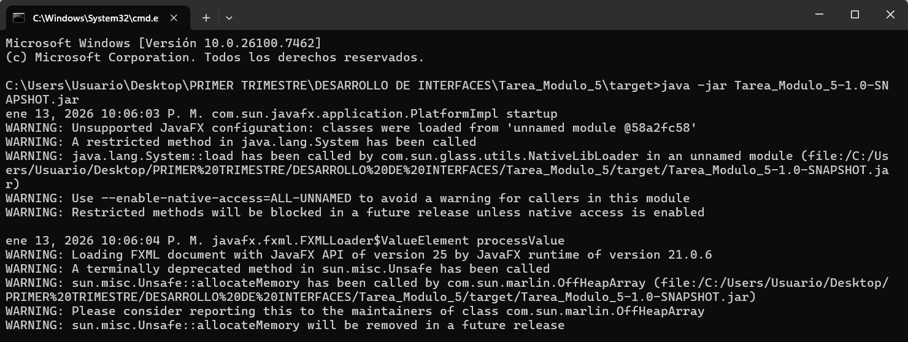

---

## 2️⃣ Creación del ejecutable (.exe) con Launch4j

Una vez verificado que el JAR funcionaba correctamente, se procedió a convertirlo en un archivo ejecutable para Windows (.exe) utilizando Launch4j.

Configuración principal:

- Header type: GUI (para evitar la consola)

- JAR de entrada: Tarea_Modulo_5-1.0-SNAPSHOT.jar

- Nombre del ejecutable: TunelDelTerror.exe

- Icono personalizado en formato .ico

Durante este proceso se resolvieron varios problemas comunes:

- Error por uso de imágenes .png como icono (Launch4j solo acepta .ico)

- Errores de versión de Java entre el JAR y el runtime

- Mensajes de “Java Runtime Environment required”

Finalmente se consiguió un ejecutable funcional, que abre directamente la aplicación gráfica.

📸 **Captura 2: Configuración de Launch4j**  

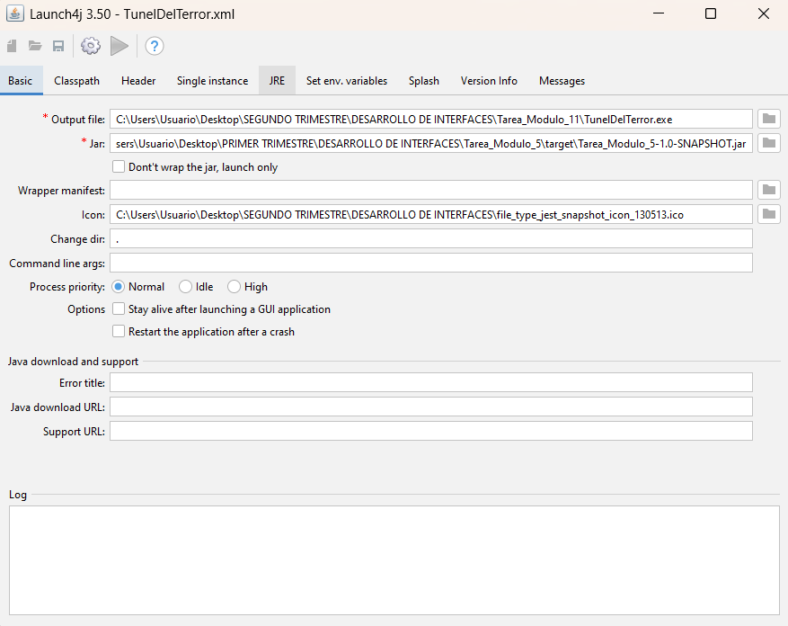
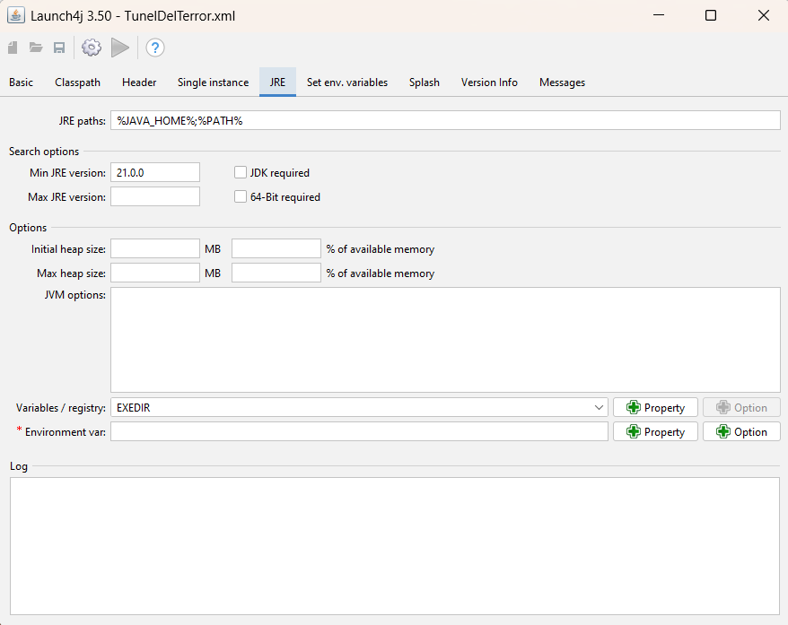

📸 **Captura 3: Ejecución correcta del archivo .exe**  

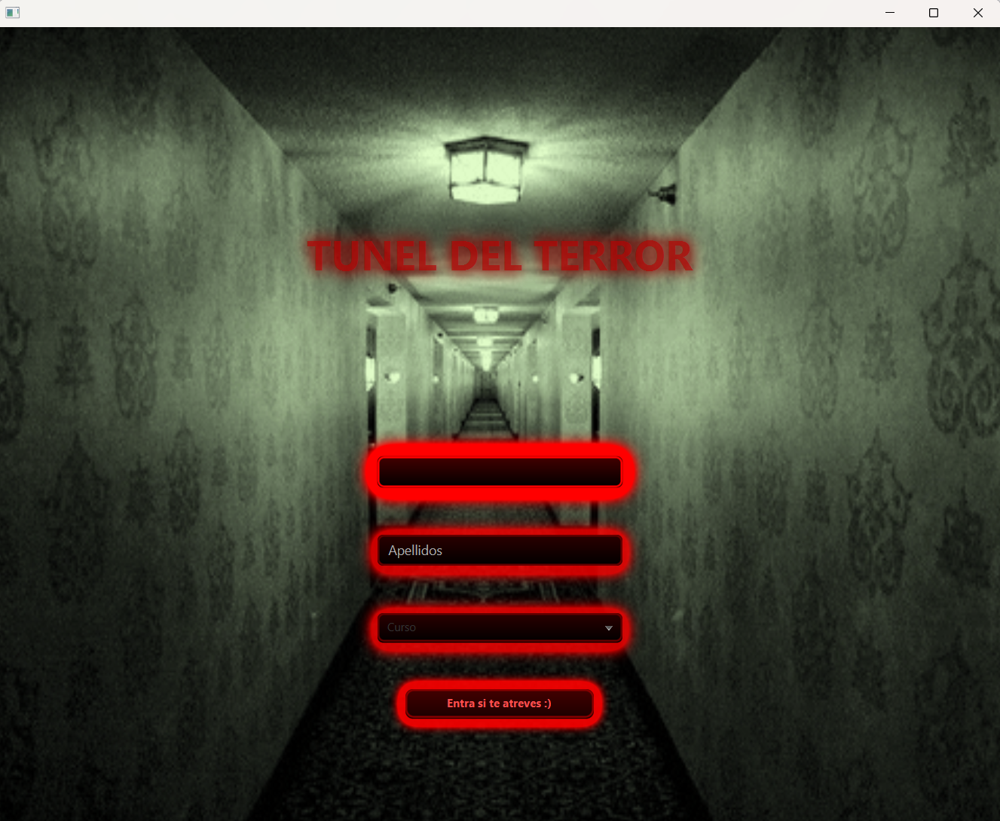

---

## 3️⃣ Creación del instalador con Inno Setup

El último paso fue crear un instalador profesional para Windows utilizando Inno Setup.

El instalador:

- Copia el ejecutable en Program Files

- Crea accesos directos en:

  - Menú Inicio

  - Escritorio

- Permite la desinstalación completa de la aplicación

- Ejecuta la aplicación al finalizar la instalación

Nombre del instalador:

**Instalador_TunelDelTerror.exe**

El script de Inno Setup fue adaptado específicamente al nombre y estructura de la aplicación.

📸 **Captura 4: Script de Inno Setup**  

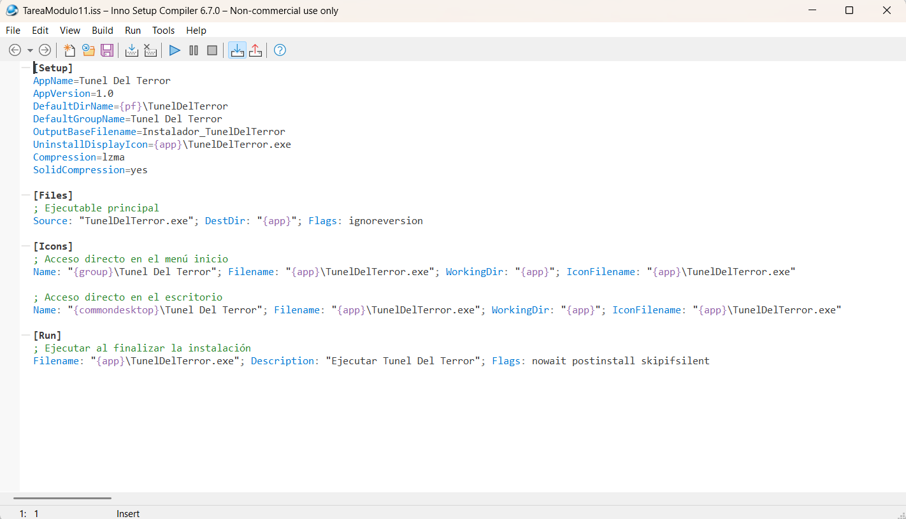

📸 **Captura 5: Asistente de instalación**  

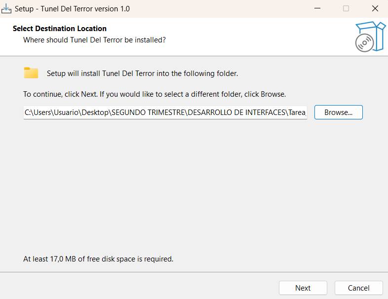
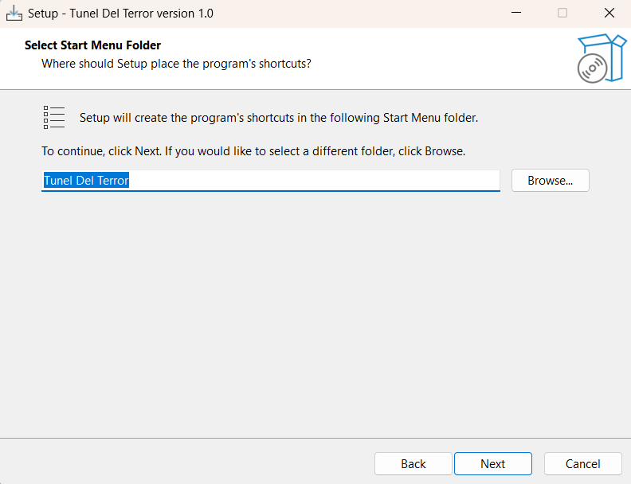
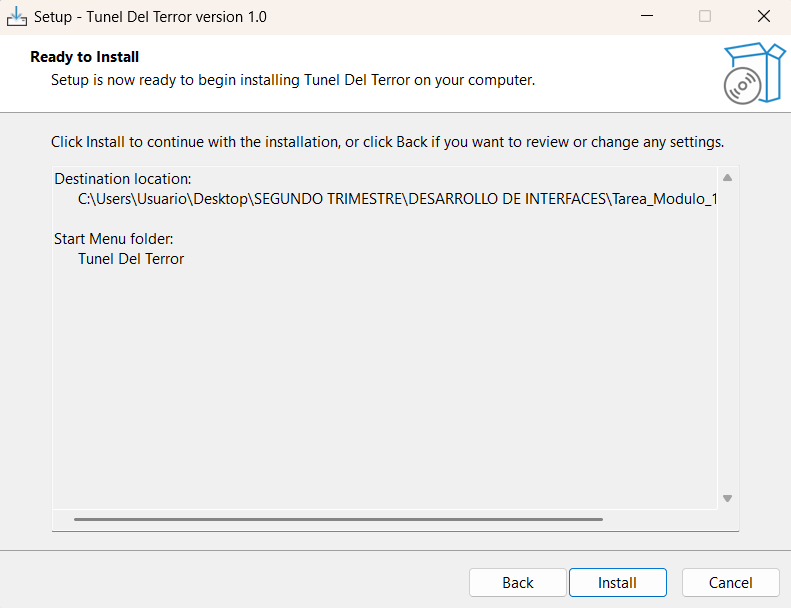
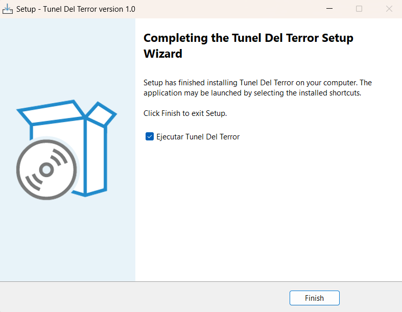

📸 **Captura 6: Acceso directo en el escritorio**  

---

## 4️⃣ Pruebas finales

✔ Instalación correcta  
✔ Ejecución desde accesos directos  
✔ Funcionamiento JavaFX  
✔ Desinstalación completa  

📸 **Captura 7: Panel de desinstalación**  

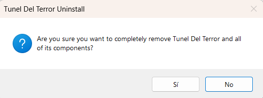
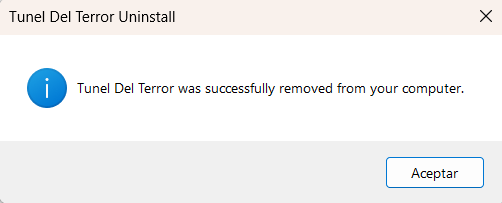

---

## 🚧 Problemas encontrados y soluciones

Durante el desarrollo de la práctica se encontraron varios problemas, entre ellos:

- Errores de clase principal mal configurada

- Problemas con JavaFX al ejecutar el JAR sin dependencias

- Incompatibilidad entre versiones de Java y el runtime

- Uso incorrecto de iconos en Launch4j

- Errores en el script de Inno Setup al copiar carpetas

Todos estos problemas se resolvieron ajustando correctamente la configuración de Maven, Launch4j e Inno Setup, asegurando un proceso de distribución estable y funcional.

---

## 🎯 Conclusión

Se ha completado con éxito el ciclo completo de desarrollo y distribución de una aplicación JavaFX, obteniendo un producto final listo para el usuario, con instalador, accesos directos y desinstalación.

La práctica ha permitido comprender el proceso real de empaquetado de aplicaciones Java en entornos Windows, así como la resolución de problemas habituales en proyectos profesionales.
